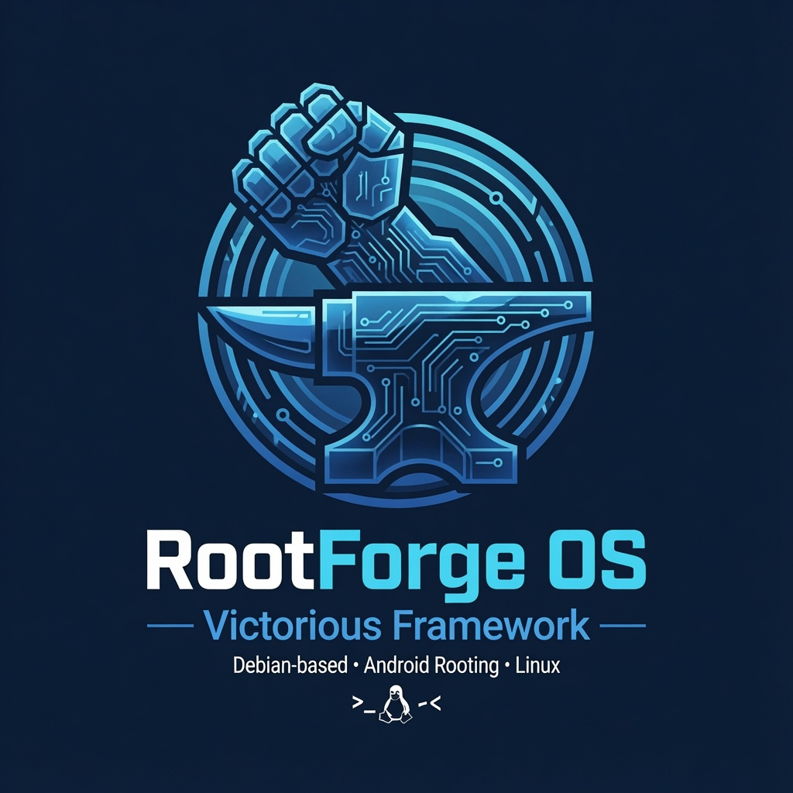

# RootForge OS — A Debian-Based Distro for Android Root Module Development

<p align="center">
  
</p>

**Victorious Framework — Origin Source Labs**
Status: Specification / Build Guide (v1.0) — living document, update in place as the toolchain evolves.

---

## 0. The assumption worth surfacing first

**[Certain]** A single automated "unlock and root" script cannot work uniformly across OEMs. Pixel, OnePlus, and most Nexus-lineage devices unlock via `fastboot flashing unlock` / `fastboot oem unlock`. Samsung uses Download Mode and Knox, not fastboot, and Knox trips permanently on unlock — no script fixes that. Xiaomi requires an OEM-approved unlock permit tied to account and a wait timer. **[Likely]** the more valuable design is a distro that auto-detects the vendor and either runs the correct fastboot sequence or tells you which out-of-band tool (Odin, Mi Unlock, MSM tool) is required, rather than one that pretends every device is a Pixel. The scripts below are written that way.

**[Certain]** The other unstated variable is host CPU architecture. KVM-accelerated emulation is fast and simple on an x86_64 host running x86_64/x86 system images. If RootForge OS itself runs on ARM64 hardware (e.g., an ARM SBC or Apple Silicon VM), you lose native KVM emulator acceleration for x86 images and need ARM64 system images plus nested virtualization support from the host hypervisor. The spec below defaults to **x86_64 host**, since that's the versatile, best-supported target for both Android Studio's emulator and Magisk/kernel cross-compilation toolchains. If you're building this for an ARM64 SBC specifically, say so and the toolchain selections change.

---

## 1. Identity

- **Name:** RootForge OS
- **Base:** Debian 12 (Bookworm), minimal netinst base + custom meta-package
- **Target host arch:** x86_64 (primary), arm64 (secondary profile, KVM caveats noted throughout)
- **Desktop:** GNOME (GNOME Shell + GDM3) — **[Likely]** this is the heavier choice versus XFCE when the same box also needs headroom for an accelerated emulator plus a kernel build running concurrently; budget accordingly (16GB+ RAM recommended over the 8GB that would be fine under XFCE) — swappable for a WM-only headless profile for CI/build-server use
- **Install path:** boots to a live session, then offers an on-disk installer (Calamares) with the same "erase disk / install alongside existing OS / manual partitioning" choice Ubuntu's own installer gives you — see section 14
- **Signed artifacts:** every module, script, and image this distro produces carries a `Victorious Framework` footer in its metadata
- **Unified CLI:** `rootforge` (`/usr/local/bin/rootforge`) is a thin wrapper around a Python package at `/usr/local/lib/rootforge/core/`. Today: `rootforge doctor` (host tooling, disk space, `~/rootforge` writability, attached devices, optional AI tooling — with `--json`, `--quiet`, `--strict`), `rootforge devices` (adb + fastboot in one list, `-l` for codename/slot/lock state, `--json`), and `rootforge module scaffold|lint|build` (P2 item 10). The `module` group is the first slice of the migration in `docs/IMPLEMENTATION_PLAN.md`: it **wraps** `new_module_scaffold.sh`, `lint_module.sh` and `build_magisk_module.sh` rather than reimplementing them — their device behaviour is proven — and moves only the argument handling into Python. That is not cosmetic. Every bug sweep over these scripts re-found the same four shell-specific failures: an unguarded `"$2"` (raw "unbound variable"), a `case` with no catch-all (a typo'd flag runs with defaults, silently), an exit code that reports success after total failure, and a `pipefail` abort that kills the script before its own error message. `argparse` gives all four for free, once, instead of needing a hand-written guard in every script. Existing scripts keep working standalone and are unaffected.

## 2. Core package stack

**Android Studio & SDK layer**
- `openjdk-17-jdk` (Android Gradle Plugin 8.x baseline)
- Android Studio (installed via official tarball, not apt — Google doesn't ship a Debian repo)
- `cmdline-tools`, `platform-tools`, `build-tools;<latest>`, `emulator`, `ndk;<LTS>` via `sdkmanager`
- `qemu-kvm`, `libvirt-daemon-system`, `virtinst`, `bridge-utils` — KVM acceleration backend for the emulator
- `gradle` (standalone, for Magisk/module builds outside Studio's wrapper when needed)

**Kernel & boot-image toolchain (the part Android Studio doesn't give you)**
- `clang`, `lld`, `llvm`, `binutils-aarch64-linux-gnu`, `gcc-aarch64-linux-gnu` — AOSP kernel builds since ~Android 11 use Clang/LLVM primarily, with GNU binutils as fallback for older trees
- `bc`, `bison`, `flex`, `libssl-dev`, `libelf-dev`, `dwarves` (for `pahole`/BTF), `cpio`, `rsync`, `kmod`
- `repo` (Google's manifest tool) + `git` for pulling AOSP/kernel/device trees
- **magiskboot** — built from Magisk source (`native/src/boot`), used for unpacking/repacking boot.img, ramdisk cpio manipulation, and dtb extraction
- **avbtool** (from AOSP `external/avb`) — for re-signing vbmeta after patching boot/init_boot, or disabling verification on eng builds
- **mkbootimg / unpackbootimg** (AOSP `system/tools/mkbootimg`) — header version 3/4 aware, since modern devices split `boot.img` and `init_boot.img`
- `abootimg`, `simg2img`, `img2simg` — sparse image conversion, legacy boot.img handling

**Root frameworks — build from source, not just installed as APKs**
- **Magisk**: full source checkout (`topjohnwu/Magisk`), built via Gradle + NDK. RootForge keeps a pinned known-good NDK version alongside the SDK-managed one, since Magisk's native build occasionally lags the latest NDK.
- **KernelSU**: kernel-integrated, so the distro's real job here is a repeatable kernel build environment — device kernel source + KernelSU as a kernel module/patch, `susfs4ksu` if you're building against a device that needs syscall hooking hidden from detection, correct `.config` fragment merging (`ARCH=arm64`, `CONFIG_KSU=y`, and whatever KMI/GKI constraints the target kernel enforces)
- **APatch** (optional third framework) — kernel-based like KernelSU but with its own patch mechanism; worth including as an alternate build target since module compatibility between the three frameworks isn't identical

**Signing & verification**
- `apksigner`, `zipalign` (from build-tools)
- `openssl` for AVB key generation
- A local **test signing keyring** kept separate from any production keys — RootForge should never accidentally use a "real" release key on a dev box

**Toolkit script dependencies** (backing sections 8–13)
- `jq` — GitHub release API parsing for `install_lsposed.sh` and `extract_ota.sh`'s self-installing `payload-dumper-go` fetch
- `docker.io` — isolated NDK/API version-matrix builds (`build_matrix.sh`); invoking user added to the `docker` group by the bootstrap script
- `e2fsprogs` — ext4 loopback mounting for `inspect_partition_image.sh`

## 3. Root module development environment

A Magisk/KernelSU module is fundamentally a zip with a specific directory layout and a small set of lifecycle scripts. RootForge's job is to make the edit → package → push → test → logcat loop as short as possible.

**Module skeleton** (see `scripts/new_module_scaffold.sh`):
```
module_name/
├── META-INF/com/google/android/{update-binary,updater-script}   # boilerplate, don't touch
├── module.prop            # id, name, version, versionCode, author, description
├── customize.sh           # optional install-time logic
├── post-fs-data.sh        # early-boot, before /data is fully mounted — for mount/bind tricks
├── service.sh             # late-start, general daemon/hook logic
├── system.prop            # prop overlay, applied at boot
├── sepolicy.rule           # optional custom SELinux policy additions (Magisk 24+)
├── system/                # files here overlay onto /system via magic mount
└── webroot/                # optional Magisk WebUI X interface (index.html + JS)
```

**Zygisk modules** get a `zygisk/<arch>.so` in addition to the above, compiled from a native `.cpp` module against the Zygisk NDK API — RootForge's Studio install should have the Zygisk API headers vendored into a template project so you're not hunting for them each time.

**KernelSU modules** use the same `module.prop`/lifecycle-script convention as Magisk (KernelSU's manager deliberately mirrors it), but *cannot* rely on Zygisk — KernelSU has no Zygisk implementation itself unless paired with an overlay like `zygisksu`. RootForge's scaffolding tool asks which framework you're targeting and drops the correct template, including the zygisksu overlay wiring if you want Zygisk-style hooking under KernelSU.

**Testing loop:** `scripts/build_magisk_module.sh` packages the zip, `adb push`es it to `/data/local/tmp`, and drives the framework's CLI (`magisk --install-module` or KernelSU's `ksud module install`) instead of requiring you to tap through the manager app UI every iteration. Combine with `adb logcat -s Magisk:* KernelSU:*` for boot-script debugging.

## 4. Bootloader unlock & rooting automation

Three scripts, deliberately separated because they're destructive operations you want to reason about independently rather than one script that does everything silently:

- `scripts/unlock_bootloader.sh` — detects vendor via `fastboot getvar all`, runs the correct unlock command for AOSP-standard devices (Pixel/Nexus-lineage: `fastboot flashing unlock`; older bootloaders: `fastboot oem unlock`), and **refuses to proceed** with a clear message rather than guessing on Samsung/Xiaomi/other vendors that need out-of-band tools. Requires typed confirmation before wiping data (unlocking always wipes on unlockable devices — this is a hardware/firmware guarantee, not a script choice).
- `scripts/flash_patched_boot.sh` — takes a stock `boot.img`/`init_boot.img`, runs it through Magisk's patch routine (either via a connected already-rooted device's Magisk app in "patch a file" headless mode, or `magiskboot` directly for KernelSU-style kernel patch application), and flashes the result to the correct slot with an A/B-aware fallback flash to the other slot if the device uses seamless updates.
- `scripts/kernelsu_patch_boot.sh` (referenced, template provided) — for KernelSU, patches happen at the kernel/boot image level rather than via an on-device app, so this script wraps the "download/build GKI kernel with KernelSU built in → flash boot" flow for GKI (Generic Kernel Image) devices, which covers most Pixels and a growing set of Treble devices since Android 12.

All three log every fastboot/adb command and their exit codes to `~/.rootforge/logs/`, since "what exactly did the last unlock attempt run" is the first question you ask when a device won't boot.

## 5. Emulator support — rooted and unrooted

`scripts/setup_rooted_avd.sh` generates both profiles through one interface, with the API level, device profile, ABI, and system-image tag all configurable rather than hardcoded, and auto-installs the chosen system image via `sdkmanager` if it isn't present yet:

```
setup_rooted_avd.sh create --name <avd> --mode rooted|unrooted [options]
setup_rooted_avd.sh boot   --name <avd> [--snapshot <name>]
setup_rooted_avd.sh list
```

`create` options: `--api <level>` (default 34), `--device <profile>` (default `pixel_6`), `--abi <abi>` (default `x86_64`), `--tag <google_apis|google_apis_playstore|default|google_tv>` (default `google_apis`), `--force` to recreate an existing AVD. Every created AVD gets a profile file under `~/rootforge/avd-profiles/<name>.conf` recording how it was built, so `boot` and `list` can recall its mode without you tracking which AVDs were rooted by memory.

**Unrooted AVDs**: a thin `avdmanager create avd` wrapper — these ship with dm-verity and won't take root without the writable-system route below.

**Rooted AVDs**: `--tag google_apis_playstore` is refused outright — Play images are signed and locked in ways that resist both the writable-system trick and a ramdisk swap, so rooted mode forces a Google APIs (or `default`/`google_tv`) image. The script then:
1. Creates the AVD (as above) and backs up its stock `ramdisk.img` to `ramdisk.img.stock` before touching it
2. Fetches the latest Magisk release APK (cached at `~/rootforge/bin/magisk.apk`) and extracts the `magisk32`/`magisk64`/`magiskinit`/`magiskpolicy` components for the target ABI
3. Patches `ramdisk.img` with `magiskboot cpio` — swapping `init` for `magiskinit` and staging the Magisk binaries under `overlay.d` — the same mechanism Magisk's own `boot_patch.sh` uses on a real device boot image, adapted for the emulator's separate ramdisk rather than a packed `boot.img`. **[Likely]** the exact `cpio` command list needs revisiting against Magisk's current `scripts/boot_patch.sh` if a future release changes its ramdisk layout — the script logs a note to that effect if root verification fails.
4. Boots the emulator writable with the patched ramdisk and verifies root live with `adb shell su -c id` rather than assuming success
5. Snapshots the booted, rooted state as `rootforge-rooted` so `setup_rooted_avd.sh boot --name <avd>` starts pre-rooted on every subsequent run instead of repeating the patch

**KVM note [Certain]:** emulator acceleration requires `/dev/kvm` access — add your user to the `kvm` group and confirm with `kvm-ok` (from `cpu-checker`) before assuming acceleration is active; a silently-software-rendered emulator is the most common "why is this so slow" support question for exactly this kind of distro.

## 6. Directory & workspace convention

```
~/rootforge/
├── devices/<codename>/          # per-device stock images, unlock notes, known-good boot.img
│   └── backups/<timestamp>/     # pre-flash partition backups + manifest.txt
├── modules/<module-name>/       # module source trees, one per project (incl. xposed/ Gradle projects)
├── modules/.cache/               # cached LSPosed/tooling downloads
├── kernels/<codename>/          # kernel source + KernelSU integration branch
├── keys/                        # AVB / test-signing keys — chmod 700, never in modules/ 
├── avd-profiles/<avd-name>.conf # rooted + unrooted AVD configs, written by setup_rooted_avd.sh
├── avd-work/                    # scratch dir for ramdisk patching (magiskboot cpio work)
├── bin/                          # self-installed tools (payload-dumper-go, magisk.apk cache, etc.)
└── logs/                        # timestamped output from every automation script
```

`~/.rootforge/ai-keys.env` (note: dotfile, outside this tree entirely) holds the
Claude Code / Grok API keys `setup_ai_tools.sh` writes — kept out of `~/rootforge/`
specifically so it doesn't end up swept into a zip or backup of the workspace by
habit. `~/second-brain/` (also a sibling, not nested under `~/rootforge/`) is a
separate, general-purpose PARA-method notes vault — see section 15's `brain` CLI
entry, not specific to root-module work the way everything above is.

## 7. Optional hardware bench integration

Since module and kernel work occasionally needs signals a fastboot cable can't give you — bootloader-level hangs before fastboot even enumerates, or debugging an EDL brick — it's worth keeping a small hand-solderable UART breakout (FTDI/CP2102 to the device's test points) on the bench, plus a Qualcomm EDL (9008) jig for Snapdragon devices where the eMMC/UFS test points are exposed pads rather than a connector. Neither requires anything beyond through-hole soldering and both are documented per-device on XDA/needrom-style device trees rather than something RootForge can generalize — worth a `devices/<codename>/hardware-notes.md` entry per device you're actively bricking and unbricking.

## 8. Root-detection & stealth verification

Building a module that hides successfully is a different job from building one that
merely installs. `scripts/check_root_detection.sh` runs the static/dynamic surface
that real root-detection libraries check against a connected device or emulator —
`ro.build.tags`, verified boot state, common su binary paths, default (non-hidden)
manager package names, Magisk DenyList enforcement status, and mount-namespace leaks
in `/proc/self/mountinfo` that indicate SUSFS hiding is needed. **[Certain]** it does
not call the real Play Integrity API — that requires a signed app talking to Google's
servers and can't be meaningfully scripted — but it accepts an optional checker APK
path to sideload one you supply, if you want a live server-side read alongside the
static checks.

## 9. LSPosed / Xposed module support

A large share of real-world root-adjacent development targets Zygisk-based Xposed
hooking rather than a bare Magisk module. `scripts/install_lsposed.sh` fetches and
installs the latest LSPosed release the same way any other module gets installed —
it *is* a Magisk/KernelSU module itself, wrapping the Zygisk hook framework. Because
an actual Xposed module is a hook class inside a real APK rather than a Magisk-style
zip, `new_module_scaffold.sh` now accepts an `xposed` target that generates a minimal
Gradle Android project instead: manifest with the `xposedmodule`/`xposedscope`
metadata, an `xposed_init` asset pointing at a Kotlin `IXposedHookLoadPackage` stub,
and a `compileOnly` dependency on the Xposed API. Build it with Gradle, sideload the
APK, then enable it per-target-app inside the LSPosed manager — LSPosed modules are
disabled by default until toggled there.

## 10. Partition backup & restore

`flash_patched_boot.sh` always recommended keeping the stock image around; it never
automated that. `scripts/backup_partitions.sh` now pulls boot/init_boot/vendor_boot/
dtbo/vbmeta before you touch anything, trying `fastboot fetch` first (supported on
many Pixel-lineage bootloaders), falling back to `adb root` + `dd` from
`/dev/block/by-name/<partition>` if the device is already rooted, and printing exact
manual `dd` instructions rather than silently skipping a partition it can't reach.
Backups land in `devices/<codename>/backups/<timestamp>/` with a manifest and a
`SHA256SUMS` sidecar — verify one at any time with
`(cd <backup_dir> && sha256sum -c SHA256SUMS)`.
`scripts/restore_partitions.sh` flashes an entire backup back in one confirmed
command — pass no timestamp to list what's available for that device. It verifies
every image against `SHA256SUMS` **before** flashing and refuses outright on a
mismatch: a truncated or bit-rotted `boot`/`vendor_boot` image is the one failure
here with no recourse afterward, and it is entirely detectable beforehand. A restore
in which any partition failed to flash exits non-zero and says which.

## 11. Firmware / OTA extraction

`scripts/extract_ota.sh` pulls partitions directly out of an official OTA zip or raw
`payload.bin`, so you can get a real stock `boot.img` to patch without a physical
device connected at all — useful for pre-building patched images for a device model
before you have hardware in hand, or for diffing what changed between firmware
versions. It self-installs `payload-dumper-go` from its GitHub releases on first run.
`scripts/inspect_partition_image.sh` complements it with a **read-only** loopback
mount of an extracted ext4/erofs image for browsing contents without flashing
anything — it refuses to mount anything other than `-o ro`.

## 12. Module linting

`scripts/lint_module.sh` catches the two bugs that account for most "why won't this
install" reports: a nested top-level folder in the zip (module.prop has to sit at
zip root, not one directory down — the single most common mistake when zipping a
module directory by hand) and CRLF line endings in the lifecycle shell scripts,
which break the shebang parse on-device. It also validates required `module.prop`
fields, the `id` character-set restriction, and META-INF boilerplate presence, and
runs against either a raw module directory or an already-built zip.

## 13. NDK / API version-matrix builds

Magisk and KernelSU native builds are sensitive to exact NDK versions in ways that
are easy to miss testing against a single pinned toolchain on the host.
`docker/Dockerfile.ndk-matrix` is a parameterized image — NDK version and API level
as build args, nothing else baked in — and `scripts/build_matrix.sh` builds your
project against a small default matrix of NDK/API combinations (or a custom
`matrix.tsv`), bind-mounting the project directory into each container so nothing
touches the host toolchain. Output is a pass/fail Markdown table with a build log
path per combination, so a break shows up as "NDK 25.2 / API 31 failed" instead of
a confusing report from whoever happened to test it on a different machine.

## 14. Install-to-disk

**[Certain]** A live-only ISO isn't what was asked for — this needs to install and
boot the same way an existing Ubuntu installation does, so it can sit on the same
disk as one. `live-build` ships a companion installer for exactly this: **Calamares**,
based on `calamares-settings-debian` rather than a from-scratch config (that base is
what MX Linux, Kali, and several other Debian derivatives already build on, so the
partition/bootloader modules are proven rather than freshly written).

The live session boots to GNOME with an "Install RootForge OS" launcher on the
desktop, same convention as Ubuntu's Ubiquity icon. Calamares' partition module
gives the same three choices Ubuntu's installer gives: erase the disk, install
alongside an existing OS (auto-detected via `os-prober` — Debian ships this
disabled by default in GRUB, RootForge turns it on specifically so an existing
Ubuntu install shows up in the dual-boot menu instead of silently vanishing), or
manual partitioning. GRUB installs in UEFI mode with a `grub-efi-amd64` target,
matching how current Ubuntu installs itself; BIOS/legacy boot is a secondary path,
not the primary target.

**[Likely]** worth being explicit about: `os-prober` re-scanning at every GRUB
update can occasionally misdetect or reorder entries on multi-OS systems — this is
a known rough edge of the exact mechanism being relied on here, not something
RootForge introduces. If a dual-boot menu ever looks wrong after installing,
`sudo update-grub` re-running `os-prober` is the first thing to check, before
assuming the install broke something.

**Getting the ISO onto a USB drive:** the build is `iso-hybrid`, so the raw ISO
file is already directly `dd`-able — no separate USB-creation tool step is
required, on Linux or macOS. Two ways to get the ISO itself:

- **Prebuilt**: download `rootforge-os-amd64.hybrid.iso` and its `.sha256` from
  [GitHub Releases](https://github.com/Victorious93/rootforge-os/releases) —
  `.github/workflows/release.yml` builds and attaches one on every tagged push.
- **Build it yourself**: `sudo make build` (runs `auto/build`, then writes
  `rootforge-os-amd64.hybrid.iso.sha256` automatically — see BUILD.md).

Then flash it:

```
make list-usb                       # sanity-check which device is actually the USB drive
sudo make flash USB=/dev/sdX        # verifies the .sha256 if present, confirms, then dd's
```

`make flash` refuses to run without a checksum match if a `.sha256` file is
present alongside the ISO, and prints the target device's size/model from
`lsblk` before the final confirmation window — **[Certain]** `dd` doesn't ask
twice and doesn't know the difference between a USB stick and your boot disk,
so that confirmation step is there on purpose; double-check `USB=` against
`make list-usb`'s output before proceeding. On Windows, there's no `dd` —
use [Rufus](https://rufus.ie/) or [balenaEtcher](https://www.balena.io/etcher/)
with "DD/ISO image mode" pointed at the same ISO file; verify the downloaded
file's SHA-256 against the published `.sha256` first either way.

## 15. AI / LLM tooling (Claude Code, Grok, Ollama, Hermes)

Bundled independently of the Android toolchain — useful on this box whether or not
you're mid-module-development. Split the same way as the SDK: small, non-churny
pieces bake into the ISO; large, personal, or frequently-changing pieces are a
first-run script, not a build-time step.

**Baked into the ISO** (small, stable): `nodejs` + `npm` (LTS from the NodeSource
apt repo, not Debian's older packaged version, since Claude Code needs a
reasonably current Node), the Claude Code CLI itself (`npm install -g
@anthropic-ai/claude-code`), and the Ollama binary + systemd service (installed via
Ollama's own install script at build time — the binary is tens of MB, not the
multi-GB territory that pushed the Android SDK to first-boot).

**First-run, not automatic** (`scripts/setup_ai_tools.sh`): API key configuration
is personal and shouldn't be baked into a shared image or run unattended. Beyond
the original Claude Code (Anthropic) / Grok (xAI) prompts, the script is now a
general key manager for any number of providers:

```
setup_ai_tools.sh add <provider> [--key KEY] [--env-var NAME] [--no-verify]
setup_ai_tools.sh remove <provider>
setup_ai_tools.sh list
setup_ai_tools.sh setup [--non-interactive --anthropic-key KEY --xai-key KEY]
```

`anthropic`, `openai`, `xai`, `gemini`, `mistral`, `cohere`, `openrouter`,
`deepseek`, `groq`, and `huggingface` are known by name — `add` picks the right
env var and verifies the key live against the provider's real `/models`-style
endpoint (or the closest unauthenticated-cost equivalent) before confirming it's
good. Any other provider works too via `add <name> --env-var SOME_API_KEY`; it's
stored the same way, just without a live check (`--no-verify` skips the check
for a known provider too, e.g. on an offline box). Every key writes to
`~/.rootforge/ai-keys.env`, `chmod 600`, sourced from the shell rc rather than
exported globally in `/etc/environment` — `add`/`remove` only ever touch their
own provider's two lines (the `export` and a `# provider:name:ENV_VAR` tracking
comment), so keys accumulate across runs instead of the whole file getting
overwritten. `setup_ai_tools.sh setup` (or no subcommand at all, for backward
compatibility) still runs the original full first-boot flow: Anthropic + xAI
prompts, the Ollama service check, AMD GPU/ROCm tuning below, a Claude Code CLI
check, and the optional Hermes pull. **Hermes** is Nous Research's open-weight
model family, pulled through Ollama rather than installed separately — offered
as `ollama pull hermes3` (and lets you pick a size tag) as an explicit opt-in,
not a default, since model weights run multiple GB each and picking one for
someone else's disk budget isn't RootForge's call to make.

**Second brain** (`brain`, baked into the ISO — `~/second-brain/` in every new
user's home directory): a local, plaintext knowledge vault using the PARA method
(Projects / Areas / Resources / Archives, plus daily notes), with semantic
search and RAG-style Q&A layered on top so the AI tooling above actually has
something to work *with* instead of starting from zero context every session.
Everything stays on-device — `brain index` embeds changed notes through
Ollama's local `nomic-embed-text` model (a small, separate opt-in pull from
`setup_ai_tools.sh`, same "explicit, not automatic" treatment as Hermes, just
a couple hundred MB instead of several GB), `brain search "query"` does cosine
similarity over the local index, and `brain ask "question"` stuffs the
top-matching notes into a prompt and answers through Ollama (`hermes3` by
default) or, with `--provider claude`, through the already-installed Claude
Code CLI for questions that need a stronger model than what's practical to
run locally. No note ever leaves the machine unless that flag is used on
purpose. `brain new`/`brain daily`/`brain list`/`brain stats` round out the
CLI for actually writing into the vault — see `~/second-brain/README.md` or
`brain --help` for the full command reference.

**[Certain]** GPU acceleration for Ollama on an AMD card goes through ROCm, and the
exact `HSA_OVERRIDE_GFX_VERSION` needed depends on which GPU generation is
installed — RDNA2 desktop cards (RX 6800-class, `gfx1030`) commonly need an
explicit override since ROCm's official support matrix lags consumer card
releases. `setup_ai_tools.sh` detects the installed AMD GPU via `rocminfo`/`lspci`
and sets the override automatically when it recognizes the generation, falling
back to printing what it found and asking rather than guessing wrong on hardware
it doesn't recognize. **[Likely]** ROCm version pinning matters more than usual
here — a newer ROCm release doesn't always mean a more stable one for a given card,
so the script logs the exact ROCm version it configured against, specifically so a
later "it got unstable after an update" report has something to diff against.

## 16. Flagship features — what makes RootForge OS stand out

Ten additions beyond the core Android-dev toolchain. **[Certain]** several of these
pull in a genuine tension with the rest of the distro rather than pretending
"harden everything" and "load unsigned kernel modules for KernelSU work" coexist
without friction — each is written to flag that instead of silently picking one
side.

**Kernel hardening** (`scripts/harden_kernel.sh`) — a sysctl hardening baseline
(`kptr_restrict`, `unprivileged_bpf_disabled`, BPF JIT hardening, reverse-path
filtering, disabled SUID core dumps) via a `/etc/sysctl.d/` drop-in. Kernel lockdown
mode is available via `--lockdown` but **not on by default** — `lockdown=integrity`
blocks loading unsigned out-of-tree modules, which directly conflicts with KernelSU
development. Enable it only on a box that isn't doing kernel-module work.

**Security hardening** (`scripts/harden_system.sh`) — AppArmor enforce mode,
auditd watching identity/SSH/USBGuard-policy files, a default-deny nftables
firewall, fail2ban for SSH, and USBGuard with a `--usbguard-learn` mode to
snapshot an allow-list from trusted gear. USBGuard matters more here than on a
typical desktop — this box's whole job is having unfamiliar Android devices
plugged in over USB.

**Intercepting proxy** (`scripts/setup_intercept_proxy.sh`) — installs mitmproxy
and automates the part that's usually manual: pushing its CA cert into a rooted
device's *system* trust store (`/system/etc/security/cacerts`), not just the user
store most modern apps ignore. `trust-cert` verifies adbd is actually running as
root and that `/system` remounted before it pushes, rather than surfacing the
failure as a confusing permission error. `start` takes the listen port as its
first argument (`start 9090`).

**VPN quick-connect** (`scripts/setup_vpn.sh`) — WireGuard keypair generation,
interface up/down, and a `peer-qr` mode that generates a phone-scannable config
QR code directly in the terminal. Peer addresses are handed out as the lowest
free slot in `10.66.66.0/24` and recorded per peer, so two peers can't be issued
the same `AllowedIPs` — a collision there doesn't fail loudly, it just silently
breaks routing for one of them.

**Headscale mesh join** (`scripts/join_headscale.sh`) — joins an *existing*
Headscale control server as a client node via the Tailscale client (API-compatible)
rather than deploying a second, competing control plane. Built for exactly the
case where a homelab already runs Headscale somewhere and this box should join
that mesh, not start its own.

**ESP32 toolkit** (`scripts/esp32_toolkit.sh`) — esptool.py + PlatformIO, with
library dependencies pre-selected for CC1101 (sub-GHz) and PN532 (NFC) rather than
generic ESP32 boilerplate, and a bare tool-node firmware scaffold (serial
command-loop skeleton) as a starting point for ESP32-based tool nodes.

**Raspberry Pi image flasher** (`scripts/flash_pi_image.sh`) — wraps the official
`rpi-imager` CLI (doesn't reimplement SD/USB writing) and adds SSH key + hostname
pre-injection plus a `--role` label (`homelab-node` / `dispatcher` / `bare`) so a
freshly flashed Pi is labeled with its intended purpose from the first boot, even
though the actual provisioning of that role happens after boot via SSH, not baked
into the image.

**Raspberry Pi fleet tools** (`scripts/rpi_fleet_tools.sh`) — local-network
discovery via MAC-OUI matching, SSH key distribution, and a batch command runner
across however many Pis answer — built for a small homelab fleet, not a
datacenter inventory system.

**Device-fleet automation** (`scripts/fleet_orchestrate.sh`) — the one script that
breaks the rest of this spec's "one device at a time" convention on purpose: runs
a chosen operation (lint, root-detect, backup, module-install, or the destructive
unlock/flash — gated behind `--allow-destructive`) across every currently
connected device in sequence, with a per-device log and a pass/fail summary table.

**Scripted IME** (`scripts/install_adb_ime.sh`) — installs a broadcast-receiver
keyboard (the ADBKeyboard pattern) so automated text input via
`am broadcast -a ADB_INPUT_TEXT` bypasses the on-screen IME's text-processing
pipeline entirely — the standard fix for `adb shell input text` mangling non-ASCII
characters and emoji during scripted UI testing.

**Upgraded terminal** (`scripts/setup_terminal.sh`) — tmux with a
`rootforge-session` launcher (logcat / device-watch / build-shell three-pane
layout), starship prompt with a custom segment showing live connected-device
count, plus fzf/eza/bat/zoxide.

## 17. Android on-device variants — unrooted (PRoot), rooted (chroot), and an optional desktop

Everything above targets a real install (bare metal or VM) with root on the box RootForge OS runs on. `termux/` adds a second delivery path: a Debian rootfs that runs *on the Android device itself*, inside Termux. There are two flavours of it, and an optional desktop layer that works with either.

### The distinction that actually decides what works

Both flavours run on **Android's own, unmodified kernel**. That is the constraint everything below follows from, and it is not the same thing as "is the phone rooted":

- **PRoot** (unrooted) fakes uid 0 and a chroot-like filesystem view by intercepting syscalls with `ptrace`, entirely in userspace.
- **chroot** (rooted) is a real `chroot(2)` entered via `su`, with `/proc`, `/sys`, `/dev` and Termux's tmp bind-mounted in.

Root buys you a real chroot and real device nodes. It does **not** buy you a different kernel — so anything needing kernel subsystems Android doesn't ship stays out of reach on a rooted phone too. Being clear about that is the point of the table below.

### Which tools work where

| Tool | ISO (real Linux) | chroot (rooted) | PRoot (unrooted) | Why |
|---|:--:|:--:|:--:|---|
| Module dev — `new_module_scaffold.sh`, `build_magisk_module.sh`, `lint_module.sh` | ✅ | ✅ | ✅ | Pure file manipulation |
| Boot image patching — `magiskboot`, `avbtool`, `mkbootimg`, `kernelsu_patch_boot.sh` | ✅ | ✅ | ✅ | Also pure file manipulation |
| OTA extraction — `extract_ota.sh` | ✅ | ✅ | ✅ | Unpacking archives |
| AI tooling — Claude Code, Ollama, `brain` | ✅ | ✅ | ✅ | Plain processes; no systemd needed |
| `adb`/`fastboot` over **Wi-Fi** | ✅ | ✅ | ✅ | Just TCP |
| `adb`/`fastboot` over **USB** | ✅ | ✅ | ⚠️ | chroot sees real USB device nodes; PRoot needs Termux:API's `termux-usb` permission flow |
| `inspect_partition_image.sh` (loop mount) | ✅ | ✅ | ❌ | Needs a real loop device; PRoot has none |
| `setup_vpn.sh` / `join_headscale.sh` | ✅ | ⚠️ | ❌ | chroot has `/dev/net/tun`, so a **userspace** WireGuard/tailscaled works; the kernel `wg` module generally does not exist |
| `build_matrix.sh` (Docker NDK matrix) | ✅ | ⚠️ | ❌ | Needs cgroup controllers + overlayfs. Root is necessary but **not sufficient** — depends on your kernel's config. Try it; don't assume |
| `setup_rooted_avd.sh` (emulator) | ✅ | ❌ | ❌ | Needs `/dev/kvm`, i.e. the SoC booted at EL2 with a KVM kernel. Root does not create that node |
| `harden_kernel.sh` | ✅ | ❌ | ❌ | Edits GRUB and sets sysctls on a kernel you own. There is no GRUB on a phone |
| `harden_system.sh` | ✅ | ❌ | ❌ | Drives AppArmor, auditd, nftables, USBGuard. Android uses SELinux and ships none of the rest |
| GNOME desktop + Calamares installer | ✅ | ❌ | ❌ | This rootfs isn't bootable; there's nothing to install it *to* |
| **XFCE via Termux:X11** | — | ✅ | ✅ | Optional layer; see below. Needs no root — an X client just talks to a socket |

Legend: ✅ works · ⚠️ works with caveats, read the reason · ❌ not available

The rooted flavour deliberately does **not** ship `harden_kernel.sh` or `harden_system.sh`. Including them would mean shipping a promise the environment cannot keep.

### Building the rootfs

Run as root on a Linux host with `debootstrap`/`qemu-user-static`/`binfmt-support` installed:

```
sudo termux/build-rootfs.sh arm64                              # unrooted (PRoot), the default
sudo termux/build-rootfs.sh arm64 --flavor chroot              # rooted
sudo termux/build-rootfs.sh arm64 --flavor chroot --with-x11   # rooted + XFCE desktop
sudo termux/build-rootfs.sh amd64                              # x86 Android, or a desktop-Linux sandbox
```

`--with-x11` roughly triples the tarball, which is why it is opt-in rather than baked in. Output is `rootforge-<flavor>-<arch>[-x11]-<timestamp>.tar.xz` plus a `.sha256`; the flavour is in the filename because a chroot rootfs and a PRoot rootfs are not interchangeable. The build also writes `/etc/rootforge/build-info` inside the image, so you can tell later what you're actually running.

`.github/workflows/release.yml` builds all four arch × flavour combinations on a tagged push and attaches them to a draft GitHub Release under stable names.

### Installing — unrooted (PRoot)

```
curl -fsSL https://raw.githubusercontent.com/Victorious93/rootforge-os/main/termux/install.sh | bash
proot-distro login rootforge
```

`termux/install.sh` installs `proot-distro`, drops the plugin into `$PREFIX/etc/proot-distro/`, and runs `proot-distro install rootforge`. It also detects root and tells you the chroot variant exists before spending a multi-GB download.

### Installing — rooted (chroot)

```
# in Termux, on the device
curl -fsSLO https://github.com/Victorious93/rootforge-os/releases/latest/download/rootforge-chroot-arm64.tar.xz
curl -fsSLO https://raw.githubusercontent.com/Victorious93/rootforge-os/main/termux/rootforge-chroot.sh
chmod +x rootforge-chroot.sh
./rootforge-chroot.sh install rootforge-chroot-arm64.tar.xz
./rootforge-chroot.sh login
./rootforge-chroot.sh umount        # when you're done, to release the bind mounts
```

The rootfs lands in `/data/local/rootforge` (override with `ROOTFORGE_CHROOT_DIR`) rather than under `/sdcard`, which Android mounts `noexec`. The launcher bind-mounts `/proc`, `/sys`, `/dev`, `devpts`, Termux's tmp, and `/sdcard` if present.

Beyond the tools the table unlocks, the practical win is speed: PRoot intercepts every syscall through `ptrace`, so builds and large greps run several times faster in a real chroot.

### Optional: a graphical desktop via Termux:X11

The X **server** is the Termux:X11 Android app. The container only runs X **clients**, which is why this needs no root and works in both flavours:

```
Android                            RootForge container
--------------------------------   ------------------------------
Termux:X11 APK   <-- X protocol --  xfce4-session, thunar, ...
  (the X server)   over a unix
                   socket in $TMPDIR/.X11-unix
```

Once, on the Termux side:

```
pkg install x11-repo
pkg install termux-x11-nightly
# plus the Termux:X11 APK from github.com/termux/termux-x11 releases
termux-x11 :0 &
```

Then enter the container so the socket is visible, and start the session:

```
proot-distro login rootforge --shared-tmp     # PRoot: --shared-tmp is required
# or: ./rootforge-chroot.sh login             # chroot: tmp is bind-mounted for you

rootforge_desktop.sh --check      # what's present, what's missing, and why
rootforge_desktop.sh              # start XFCE
rootforge_desktop.sh --install    # if you didn't build --with-x11
```

`rootforge_desktop.sh --check` is worth running first — the two common failures are logging in without `--shared-tmp` (no socket visible) and forgetting to open the Termux:X11 app after starting the server (socket directory present but empty), and it names both specifically rather than leaving you with a blank screen.

XFCE rather than GNOME: GNOME wants systemd/logind and a compositor stack that neither flavour can provide. XFCE runs as a plain X client with no session manager underneath it.

**[Likely]** the proot-distro plugin file's shape (`DISTRO_NAME`/`DISTRO_COMMENT`, `TARBALL_URL`/`TARBALL_SHA256` associative arrays, an optional `distro_setup()` hook) matches proot-distro's current plugin API — it has been stable, but isn't something this repo can pin a version of, so check against a plugin shipped in proot-distro's own repo if `install` rejects it.

## 18. What's still a manual step

Bootloader unlock permits for Xiaomi/OnePlus regional variants that require an account-linked waiting period, Samsung Download Mode flashing (Odin/Heimdall, not fastboot), and initial OEM driver installation on the host for less common vendors. RootForge's scripts detect these cases and stop with an explanation rather than failing silently or guessing.

-Victorious Framework 
